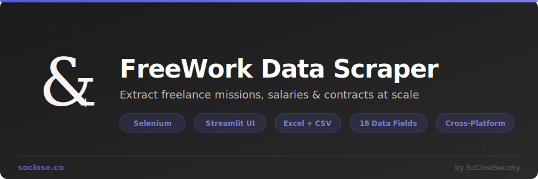

<p align="center">
  
</p>

<p align="center">
  <strong>Extract freelance missions, salaries & contracts from <a href="https://www.free-work.com/">free-work.com</a> at scale.</strong>
</p>

<p align="center">
  
  
  
  
</p>

---

## Features

- **18 data fields** per job — title, company, salary/TJM, remote policy, duration, experience, skills, description, and more
- **Streamlit web UI** — visual dashboard with live progress, metrics, and one-click downloads
- **CLI mode** — scriptable command-line interface with full argument support
- **Excel export** — color-coded headers, salary highlighting, clickable links, auto-filters, and a summary sheet
- **CSV export** — UTF-8 encoded, ready for any data tool
- **Smart pagination** — automatically detects and navigates all result pages
- **SVG icon matching** — identifies job attributes (salary, remote, duration, etc.) by matching SVG icon paths
- **Cross-platform** — works on Windows, macOS (Intel & Apple Silicon), and Linux
- **Human-like behavior** — random delays between requests to avoid detection

## Project Structure

```
FreeWorkDataScraper/
├── main.py                              # CLI entry point
├── app.py                               # Streamlit web UI
├── requirements.txt                     # Python dependencies
├── freework_scraper/
│   ├── __init__.py                      # Package metadata (version, author)
│   ├── config.py                        # Constants, CSS selectors, SVG icon paths
│   ├── models.py                        # FreeWorkJob dataclass
│   ├── scraper/
│   │   ├── browser.py                   # Selenium Chrome browser manager
│   │   ├── search.py                    # Search page navigation & pagination
│   │   └── job_extractor.py             # Job detail page parser
│   └── export/
│       └── exporter.py                  # CSV & Excel export with formatting
└── assets/                              # Branding assets (banner, logo)
```

## Prerequisites

- **Python 3.10+**
- **Google Chrome** installed on your system
- ChromeDriver is managed automatically via `webdriver-manager`

## Installation

```bash
# Clone the repository
git clone https://github.com/SoCloseSociety/FreeWorkDataScraper.git
cd FreeWorkDataScraper

# Create a virtual environment (recommended)
python -m venv venv
source venv/bin/activate        # macOS / Linux
# venv\Scripts\activate         # Windows

# Install dependencies
pip install -r requirements.txt
```

## Usage

### 1. Streamlit Web UI (recommended)

```bash
streamlit run app.py
```

This opens a dashboard in your browser where you can:
- Paste a FreeWork search URL
- Configure max pages, headless mode, and export format
- Watch live progress with real-time logs
- View results in an interactive table
- Download Excel and CSV files directly

### 2. Command Line

```bash
# Interactive mode — prompts for the URL
python main.py

# Direct URL mode
python main.py --url "https://www.free-work.com/fr/tech-it/jobs?query=python&contracts=contractor"

# With options
python main.py \
  --url "https://www.free-work.com/fr/tech-it/jobs?query=devops" \
  --max-pages 5 \
  --format excel \
  --output results \
  --no-headless
```

#### CLI Options

| Flag | Description | Default |
|---|---|---|
| `--url`, `-u` | FreeWork search URL (with filters applied) | *(interactive prompt)* |
| `--output`, `-o` | Output directory for exported files | `output` |
| `--format`, `-f` | Export format: `both`, `excel`, `csv` | `both` |
| `--max-pages` | Max pages to scrape (0 = all) | `0` |
| `--headless` | Run Chrome in headless mode | `True` |
| `--no-headless` | Run Chrome with visible window | `False` |
| `--version`, `-v` | Show version and exit | — |

## How It Works

1. **Navigate** — Opens the FreeWork search URL in a headless Chrome browser
2. **Paginate** — Detects total result pages from pagination buttons and iterates through each
3. **Collect** — Extracts all job detail links from each search results page
4. **Extract** — Visits each job page and parses 18 data fields using BeautifulSoup, including SVG icon matching for structured attributes (salary, remote, duration, experience, location, start date)
5. **Export** — Generates professionally formatted Excel (with color-coded headers, conditional formatting, summary sheet) and/or CSV files

## Extracted Data Fields

| Field | Description |
|---|---|
| Title | Job posting title |
| Company | Company name |
| Company Location | Company city |
| Category | Job category (e.g., freelance, CDI) |
| Location | Mission location |
| Remote | Remote work policy |
| Salary / TJM | Daily rate or salary |
| Duration | Contract duration |
| Experience | Required experience level |
| Start Date | Mission start date |
| Publish Date | When the posting was published |
| Skills | Technologies and skills listed |
| Sector | Industry sector |
| Description | Full job description |
| Job URL | Link to the original posting |
| Page | Search result page number |
| Scraped At | Timestamp of extraction |
| Status | Extraction status (ok/error) |

## Excel Output

The Excel export includes:
- **Color-coded column headers** grouped by category (identity, details, contract, dates, skills, content, meta)
- **Salary highlighting** — green for jobs with salary info, red for missing
- **Remote highlighting** — purple tint for jobs with remote policy
- **Clickable URLs** — job links are hyperlinked
- **Auto-filters** on all columns
- **Frozen header row** and first column
- **Alternating row colors** for readability
- **Summary sheet** with statistics (total jobs, salary %, remote %, experience breakdown)

## Dependencies

| Package | Purpose |
|---|---|
| `selenium` | Browser automation |
| `webdriver-manager` | Automatic ChromeDriver management |
| `beautifulsoup4` | HTML parsing |
| `lxml` | Fast HTML parser backend |
| `pandas` | Data manipulation and CSV export |
| `openpyxl` | Excel file creation and formatting |
| `streamlit` | Web UI dashboard |

## Contributing

Pull requests are welcome. For major changes, please open an issue first to discuss what you would like to change.

## License

[MIT License](LICENSE) — Copyright (c) 2022 Enzo Day

---

<p align="center">
  Built by <a href="https://soclose.co"><strong>SoClose</strong></a> — Digital Innovation Through Automation & AI
</p>
